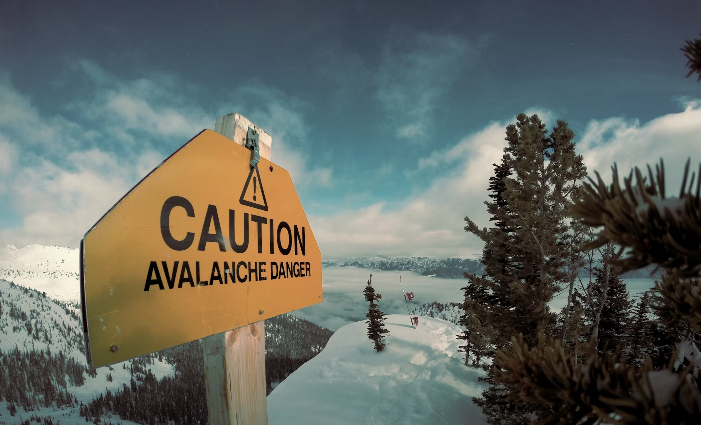

# Avalanche ("Deadly Collapse: A Soulful Death")

## Table of Contents 📜

1. [Description 📚](#description-)
2. [Himalayan Expeditions 🏔️](#himalayan-expeditions-)
3. [Avalanches: An Overview 🌨️](#avalanches-an-overview-)
4. [The Role of Machine Learning in Predicting Avalanches 🤖](#the-role-of-machine-learning-in-predicting-avalanches-)
5. [ML Model Accuracy Obtained 📊](#ml-model-accuracy-obtained-)
6. [Dataset Description 📁](#dataset-description-)
7. [Plot Analysis Results 📈](#plot-analysis-results-)
8. [License 📜](#license-)

## Description 📚

This project aims to predict the occurrence of avalanches during Himalayan expeditions using machine learning techniques. Avalanches pose significant risks to mountaineers and understanding the factors contributing to such events can help in mitigating these risks.

## Himalayan Expeditions 🏔️

Himalayan expeditions are challenging and adventurous undertakings that attract climbers from around the world. The Himalayas, home to some of the highest peaks on Earth, including Mount Everest, present a unique set of challenges including extreme weather conditions, high altitudes, and difficult terrain.

## Avalanches: An Overview 🌨️

An avalanche is a rapid flow of snow down a slope, which can be triggered by various factors such as heavy snowfall, wind, temperature changes, and human activity. Avalanches can cause significant loss of life and property, making it crucial to predict and prepare for these events.

 
 

## The Role of Machine Learning in Predicting Avalanches 🤖

Machine learning (ML) can play a vital role in predicting avalanches by analyzing historical data and identifying patterns that precede such events. By training ML models on data related to weather conditions, geographical features, and past incidents, we can predict the likelihood of avalanches and take preventive measures.

## ML Model Accuracy Obtained 📊

1. **Voting Classifier** - 100.0% (overfit, trying to optimize it with advanced techniques)
2. **Grid Search CV** - 99.99%

## Dataset Description 📁

The dataset used in this project, `Avalanche_data.csv`, contains information about various expeditions in the Himalayas and associated incidents.

The dataset was sourced from [Kaggle](https://www.kaggle.com/datasets/raskoshik/himalayan-expeditions).

## Plot Analysis Results 📈

 
 
 
 

## License 📜

MIT
